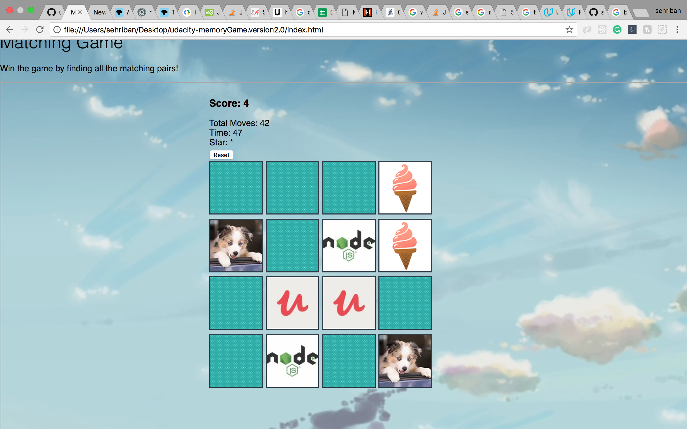

# README

Udacity- Memory Game
===================

**Memory Game** is a card game in which all of the cards are laid face down on a surface and two cards are flipped face up over each turn. The object of the game is to turn over pairs of matching cards.

----------

----------

----------

----------

**Sherry Cheng** - https://github.com/sgc88

----------

Technologies
-------------------
* HTML
* CSS
* Bootstrap
* javascript
* shuffle()
*  setTimeout()
* clearInterval()
*  setAttribute()
*  classList.add()
* while loop
*  for loop
*  nested for loop

----------

Existing Features
-------------------
* User can flip two card
* if 2 flipped cards match it will stay flipped and the user will get a score
* If the cards don't match, they flip back.
* The user need to get 3 match pairs to win the game.
* Once the user wins the game it will display playing time
* Once the user wins the game it will display how many moves the user took.

----------

Planned Features
-------------------
* Be able to invite people via email/text to play the game.
* Be able to play with 2 players.
* Be able to have a different/ multiple boards
* Be able to play with people from different locations.

* ...
Useful Researches:
*https://www.google.com/
*https://www.w3schools.com/jsref/met_win_clearinterval.asp
*https://stackoverflow.com
*https://developer.mozilla.org/
*https://developer.mozilla.org/en-US/docs/Web/API/Element/setAttribute
*https://classroom.udacity.com
*https://www.safaribooksonline.com/library/view/javascript-cookbook/9781449390211/ch09s08.html
